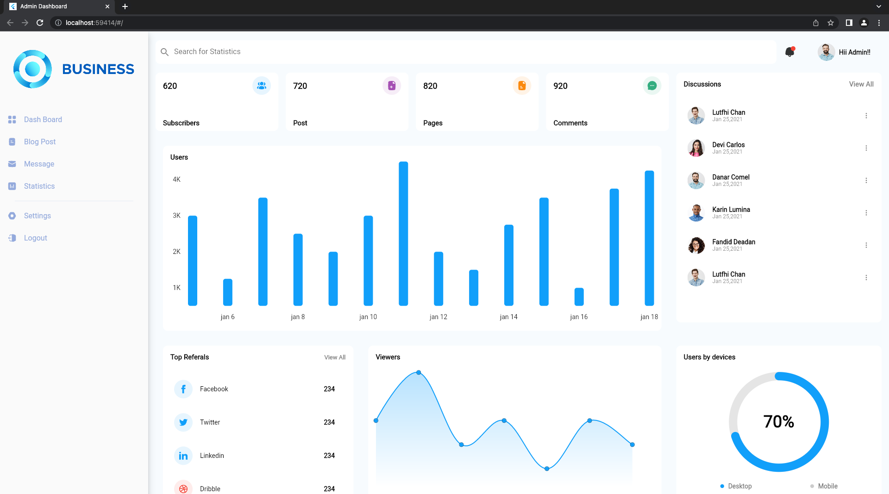
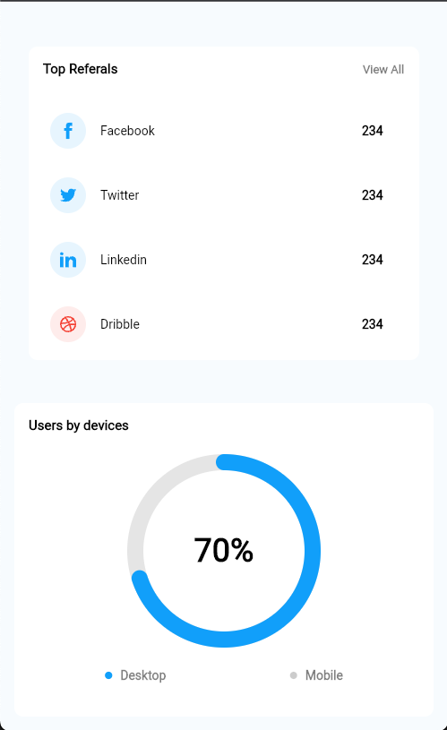

# admin_pannel
 Responsive Admin Panel
 
 Use the following Dependencies & SDK to pubspec.yaml

# ScreenShots
 Web View

 
 
 Tab View
 
 

 Mobile View

     

# Version 
 version: 1.0.0+1

# environment
 environment:

 sdk: ">=2.12.5 <3.0.0"
 
# Set it on down Dependencis
## The following adds the Cupertino Icons font to your application.
## Use with the CupertinoIcons class for iOS style icons.
 cupertino_icons: ^1.0.2 

 flutter_svg: ^0.22.0

 fl_chart: ^0.36.1

 provider: ^5.0.0

 data_table_2: ^2.0.3
 

